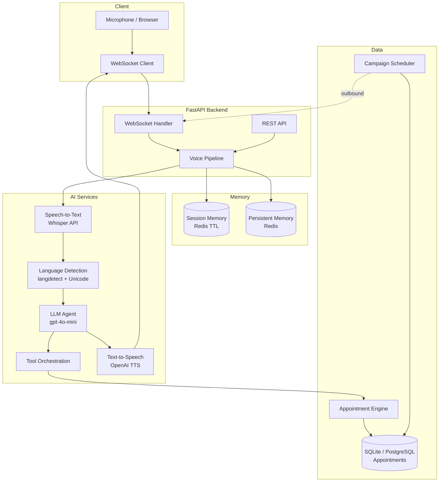

# 2Care.ai Voice AI Agent — Architecture

## System Diagram

## Latency Pipeline

| Stage | Typical (mock) | Typical (production) |
|-------|----------------|----------------------|
| STT (Whisper) | 0 ms | 80–150 ms |
| Language detection | 1–5 ms | 1–5 ms |
| Agent + tools | 50–200 ms | 150–300 ms |
| TTS | 0 ms (mock) | 80–120 ms |
| **First audio (e2e)** | **< 100 ms** | **Target < 450 ms** |

Metrics are logged as `LATENCY {...}` and returned in every WebSocket/API response under `latency`.

## Memory Design

### Session Memory (Redis `session:{id}`, TTL 1h)

- Conversation messages (last 20 turns)
- Pending intent slots (doctor, date, intent)
- Outbound campaign context

### Persistent Memory (Redis `patient:{id}`, TTL 30d)

- Preferred language
- Last doctor / hospital
- Past appointment summaries
- Interaction count

## Tool Orchestration

| Tool | Scheduling action |
|------|-------------------|
| `check_availability` | Query `doctor_schedule`, filter past/booked |
| `book_appointment` | Validate + insert `appointments` |
| `cancel_appointment` | Set status `cancelled` |
| `reschedule_appointment` | Book new + cancel old |
| `list_appointments` | Query active bookings |

## Trade-offs

- **SQLite default**: Zero-config for assignment demo; swap `DATABASE_URL` for PostgreSQL in production.
- **OpenAI stack**: Fastest path to quality STT/LLM/TTS; mock mode works without API keys.
- **Batch audio WebSocket**: Simpler than full duplex streaming; streaming STT would further reduce latency.
- **gpt-4o-mini**: Balance of speed and tool-calling accuracy.

## Known Limitations

- True sub-450ms latency requires streaming STT, edge TTS, and regional API endpoints.
- Tamil/Hindi TTS voice selection is limited to OpenAI voice presets.
- Barge-in (interrupt) is not implemented in v1.
- Outbound calls are simulated via WebSocket campaign mode, not PSTN telephony.
